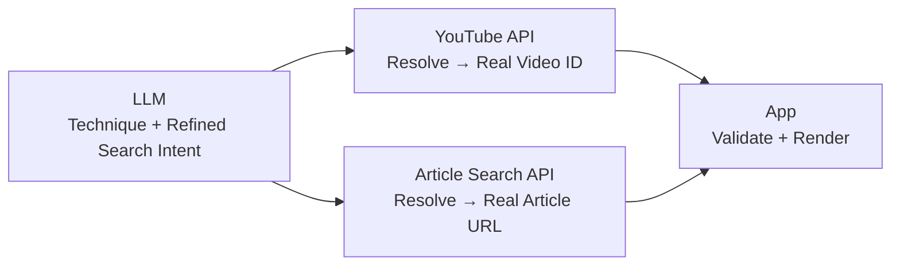

## HOBBY-SCOPE
a passion project where you can get better at your hobbies without overwhelm, core feature is it generates a tailored roadmap according to your level

### todos
- [x] add background patterns for 3 pages @/components/pattern
- [x] add pacman loader for the time AI response generates
- [ ] mabye we can add a scroll and drag for landing page
- [x] code cleanup - ai spat batshit
- [x] wtf with the gitignore, can't ignore the env files
- [x] UX for "new plan", "go back to home", "access all plans"
- [x] figure out YT embed links
- [x] og, favicon, metadata, branding
- [ ] articles are short description and not actual use and links attached are invalid
- [ ] maybe we can add a celebration when users complete all the techniques

### tech used 
- using pplx api as primary and openrouter as fallback for the ai response
- using youtube data api v3 for youtube links and serper.dev for google search links
- created all the image assets of retro cartoon (i've named him Otis, yes with an O initial, same as my name)

### note
if the app at `/plan` isn't returning any youtube embed links or an article links when you generate a plan, its probably because it has hit the API usage limit.
you can reach out at `ojusxe@gmail.com` and i'll fix that

### backend working

### credits
- https://uiverse.io/jaykdoe/tasty-dragon-12
- https://uiverse.io/artvelog/splendid-quail-83
- https://www.badtz-ui.com/docs/components/expandable-card

